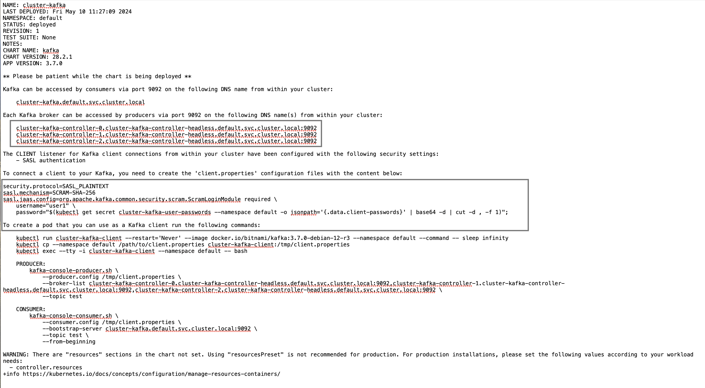

# kafka-based-compensation-processing-system
## Overview 
The project presents a Kafka-based data processing architecture tailored for managing compensation rates and employee records. For more details, please refer to the file `6G-Assessment-Application.pdf`. The setup includes: 

1. Deploying a Bitnami Kafka cluster with three brokers.

2. Configuring a Python-based web server to expose endpoints for JSON data submission via HTTP POST requests, enabling seamless integration with Kafka topics.

3. Implementing two consumers operating in separate groups to analyze the data, generate JSON outputs, and compute employee compensation.

4. Deploying a client pod specifically for sending POST requests to the Python-based web server. 


## Prerequisites 
* Docker Desktop
* macOS
* Helm 


# Deploying a Bitnami Kafka cluster with three brokers.

We will install Kafka using a Helm chart. First, add the Bitnami repository to your local Helm configuration:

```
helm repo add bitnami https://charts.bitnami.com/bitnami
```

Next, deploy a Bitnami Kafka cluster with three brokers in the `default` namespace by running the following command:

```
helm install cluster-kafka bitnami/kafka
```

After installation, detailed instructions and essential information regarding the deployment and configuration of the Kafka cluster will be displayed. Be sure to save this information, as it will be necessary for accessing Kafka. You can also experiment with a pod consumer or producer to verify that the cluster is up and running. </br>
Here's an example of what the detailed instructions and essential information may look like:




The highlighted parts will be stored in a `configMap` and a `secret`. Through the `configMap` resource, applications (including the two consumers and the Python web server) will be guided on connecting to the Kafka cluster. Meanwhile, the `secret` resource ensures secure authentication between applications (clients) and brokers using the SCRAM-SHA-256 mechanism with the specified username and password. </br>

Each time a Kafka cluster is installed, a new user password is required to access the cluster. The following instructions explain how to extract, encode, and update the password in the `secret` resource. </br>
First, retrieve the Kafka user password from the Kubernetes secret named `cluster-kafka-user-passwords`:

```
password="$(kubectl get secret cluster-kafka-user-passwords --namespace default -o jsonpath='{.data.client-passwords}' | base64 -d | cut -d , -f 1)";
```

Next, encode the extracted password using base64:

```
encoded_password=$(echo -n $password | base64)

```

Encode the value of the variable `user` using base64:

```
user=user1
echo -n $user | base64
```

Create or update the `kafka-cred` secret with the newly encoded user credentials. 

```
cat <<EOF > kafka-cred.yaml
apiVersion: v1
data:
  password: $encoded_password
  user: dXNlcjE=
kind: Secret
metadata:
  name: kafka-cred
type: Opaque
EOF
```

The `user` field in the secret contains the base64-encoded value of the user variable and the `password` field contains the base64-encoded value of the password variable.</br>
Now, create the `kafka-settings` configmap: 


```
apiVersion: v1
data:
  BOOTSTRAP_SERVERS: cluster-kafka-controller-0.cluster-kafka-controller-headless.default.svc.cluster.local:9092,cluster-kafka-controller-1.cluster-kafka-controller-headless.default.svc.cluster.local:9092,cluster-kafka-controller-2.cluster-kafka-controller-headless.default.svc.cluster.local:9092
  PARTITIONS_EMPLOYEE: "2"
  REPLICAS_EMPLOYEE: "2"
  TOPIC_EMPLOYEE: "employee"
  TOPIC_COMPENSATION: "compensation_rates"
  PARTITIONS_COMPENSATION: "2"
  REPLICAS_COMPENSATION: "2"
  CONSUMER_GROUP_EMPLOYEE: "employee.grp-0"
  CONSUMER_GROUP_COMPENSATION: "compensation.grp-1"
kind: ConfigMap
metadata:
  creationTimestamp: null
  name: kafka-settings

```

Apply both resources using the following command:
```
kubectl apply -f kafka-cred.yaml -f kafka-settings.yaml
```

# Building Docker Images and Running Pods

## Run the webservice pod


Navigate to the `webservice` directory and run the following command to build a Docker image named webservice using the Dockerfile in the current directory:

```
docker build -t webservice .
```

Apply the `webserver.yaml` file to run the pod using the webservice image.

The webservice application is a Python-based web server designed to interact with the Kafka cluster just deployed. The web server performs the following key functions:

1. Topic Creation: On startup, the web server creates two Kafka topics: `employee` and `compensation_rates`. These topics are used to ingest data into the Kafka system.

2. Endpoints: The web server exposes two HTTP endpoints for data submission. Each endpoint is designed to handle JSON-formatted data and publish it to the corresponding Kafka topic. For instance:

* To submit data to the `employee` topic, you will need to hit the following endpoint: http://web-server-ip:port/api/employee.
* To submit data to the `compensation_rates` topic, you will need to hit the following endpoint: http://web-server-ip:port/api/compensation.


## Run the py-httpie pod

This pod will be used to send HTTP POST requests to submit data to the Kafka topics.</br>
Navigate to the `api-client` directory and run the following command to build a Docker image named ` py-httpie`:

```
docker build -f dockerfile-http -t py-httpie .
```

Apply the file `py-httpie-pod.yaml` file to run the pod using the py-httpie image:

```
kubectl apply -f py-httpie-pod.yaml
```

* To submit data to the `employee` topic, log in to the pod `py-httpie` pod and use the following command:
```
http post <web-service-ip>:8088/api/employee
```
* To submit data to the `compensation` topic, log in to the pod `py-httpie` pod and use the following command:
```
http post <web-service-ip>:8088/api/compensation
```
Replace <web-service-ip> with the IP address of the webservice pod.
Check the logs of the `webservice` pod and look for a 201 response to confirm that the messages were successfully published to the topic.

## Run the consumer-compensation pod


Navigate to the `consumer-compensation` directory and run the following command to build a Docker image named `consumer-compensation` using the Dockerfile in the current directory:


```
docker build -t compensation-rates-consumer .
```

This docker image contains the instruction to run a consumer that reads messages from the `compensation` topic and writes each message to a file (shared/data.json). Those data will be made available to the other consumer using this multi-container setup and shared volumes. This consumer will be part of the consumer group called `compensation.grp-1` 


## Run the consumer-compensation pod

Navigate to the `calculator` directory and run the following command to build a Docker image named `calculator` using the Dockerfile in the current directory:

```
docker build -t calculator .
```

 This docker image contains the instruction to run a consumer that reads data from the json file created by the previous consumer, and calculates the compensation for each employee stored in the `employee` topic


 The two consumers will be part of two different con because we want to separate the two flow of data coming from two diffent topics namely `compensation` and `employee.` See the `myapp.yaml` file for more info.